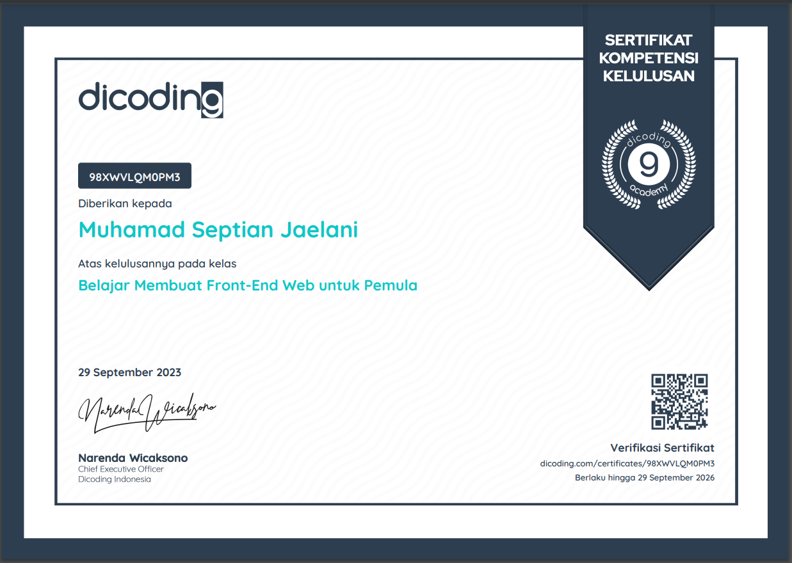

# Submission for Belajar Membuat Front-End Web untuk Pemula

## Description

This repo is for a submission of a course from Dicoding.

## Features

- Add New Books
- Delete Books
- Delete Modal / Confirmation
- Move Read books to Unread books or the other

  

  

